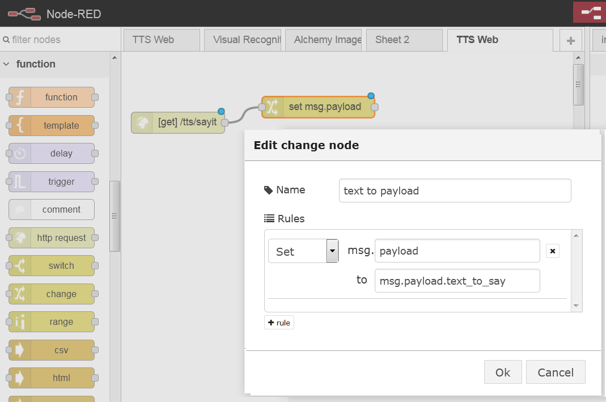
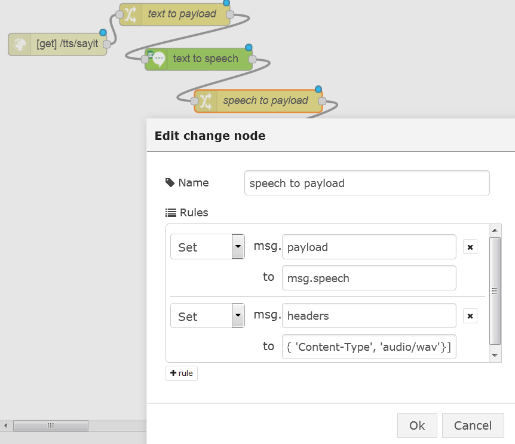

# Watson-Node-Red-examples

A collection of examples on how to use the Watson nodes in Node-RED.

These Watson nodes are used:

- Language Identification
- Language Translation
- Personality insights
- Speech to Text
- Text to Speech
- Tradeoff Analytics
- Visual Recognition


First you need an instance of Node-RED with Watson services. Therefore you need a Bluemix account. You can get that here: http://www.bluemix.net.

Once you are in Bluemix, go to Catalog and then go to the boilerplate section and select Node-RED Starter, in the next screen, give your application a name and click create.

You need to add the services you want to use to your application. Go to the dashboard and click on your application, then click on Add a Service or API. In the following screen select the service you want to use, and finally click on use. Wait for a moment to restart the application. When the application is started you can click on the URL to open Node-RED.

Another way of using Node-RED is installing it locally, which can be done by following this:

Check out http://nodered.org/docs/getting-started/ for full instructions on getting started.

    sudo npm install -g node-red
    node-red
    Open http://localhost:1880
    
You have to install the Watson Nodes, which is described here: http://flows.nodered.org/node/node-red-bluemix-nodes
and you have to make the services available in Bluemix.

DESCRIBE THAT

Note that Node-RED in BlueMix will behave slightly differently than Node-RED stand-alone:

1. The sets of available nodes differ, BlueMix has extra nodes for DB access, but does not expose the `File` nodes.
2. Node-RED in bluemix stores its persistent data (flows, libraries, credentials) in the co-installed Cloudant database named
`nodered`. When using a Cloudant node with Node-RED on BlueMix, the list of available instances is automatically listed.
3. Node-RED in BlueMix has built-in credential management, so you don't have to worry about exposing your services authentication data, they will be filled-in automatically from the sevices' credentialds defined for the application in BlueMix.
4. Additional nodes in Node-RED on BlueMix are installed through cf and a specific procedure since there is no direct access to the npm package manager.

## Language Translation

The Language Translation service enables you to translate text from one language to another.


....Work in progress...More to come in a moment...

##  Text to Speech
### Overview
The Watson text-To-Speech (TTS) service produces an audio file from literal text.
The spoken text can be emitted with a choice of voices and languages.

### Node-RED Watson TTS node
The Node-RED node provides a very easy wrapper node that takes a text string as input and produces a binary buffer holding the spoken text audio stream in `.wav` format.
The selection of language and voice are made through  the node's properties editor.

### Basic TTS Flow
In this first exercise, we will show how to simply produce a `.wav` file from input text through a simple web page generated using a Node-RED flow.

The first part of the flow will take text input from a web invocation and return the spoken text `.wav` file:

1. Create a new flow, let's call it `TTS Web` 
2. Add an  node to collect the incoming speech request. Set the `URL` property of this node to `/tts/sayit` This URL will be exposed below our BlueMix main URL.

When invoked with query parameters such as `?text_to_say=Hello`, they will be added as properties on the `msg.payload` object. 
3. Add a  node to extract the query parameter `msg.payload.text_to_say` and set it as the `msg.payload`.

We do this because the TTS node uses the text in the `msg.payload` as input.
4. Now add a  node. This node will generate the binary `wav` stream content to the `msg.speech` property.

The properties of the TTS node will let you select the Language and Voice to use.
5. Add another  node to extract the `msg.speech` and place it in `msg.payload`.

6. Finally, add a   node. This node will simply return what's in the payload to the HTTP response.
The completed flow should look like:

The flow code for this is in [TTS-Lab-Basic](flows/TTS/TTS-Lab-Basic.json)
```
[{"id":"ba6b02ff.ca0198","type":"http in","name":"","url":"/tts/sayit","method":"get","swaggerDoc":"","x":74.19999694824219,"y":64.19999694824219,"z":"24bf0254.aa8b26","wires":[["5c1ceeb9.5744b"]]},{"id":"5c1ceeb9.5744b","type":"change","name":"text to payload","rules":[{"t":"set","p":"payload","to":"msg.payload.text_to_say"}],"action":"","property":"","from":"","to":"","reg":false,"x":231.1999969482422,"y":24.199996948242188,"z":"24bf0254.aa8b26","wires":[["e3510257.ea6e78"]]},{"id":"e3510257.ea6e78","type":"watson-text-to-speech","name":"","lang":"english","voice":"en-US_MichaelVoice","x":263.20001220703125,"y":89.19999694824219,"z":"24bf0254.aa8b26","wires":[["16f20e6f.d935c2"]]},{"id":"16f20e6f.d935c2","type":"change","name":"speech to payload","rules":[{"t":"set","p":"payload","to":"msg.speech"}],"action":"","property":"","from":"","to":"","reg":false,"x":343.20001220703125,"y":151.1999969482422,"z":"24bf0254.aa8b26","wires":[["9d08ab41.809e48"]]},{"id":"9d08ab41.809e48","type":"http response","name":"","x":415.20001220703125,"y":211.1999969482422,"z":"24bf0254.aa8b26","wires":[]}]
```

Now try the flow: Open a new tab or window in your browser, and direct it to `/http://xxxx.mybluemix.net/tts/sayit?text_to_say=Hello`
This should prompt you to save a file. Depending on how your browser is configured, it may save it automatically or prompt for a name and location. In any case, store it with the `.wav` extension on your local file system. 
Then locate that file from windows explorer and open it with Windows Media Player, turn your you should

### TTS Flow - enhancements
The flow as designed has a few caveats. First, if the `text_to_say` query parameter is not set, the flow will throw an error and not complete. Second, the mime type and name for the returned audio file has not been set explicitly, which may cause some browsers not to be able to play the audio file properly.

So, 